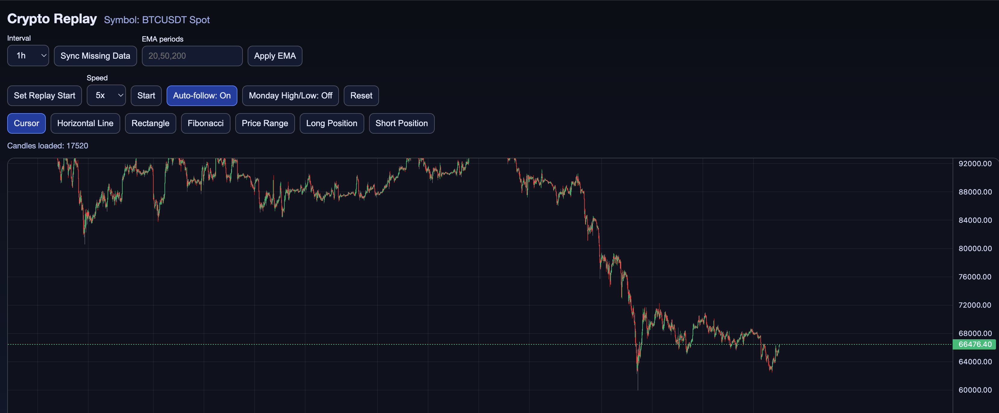

# Crypto Replay (Local MVP)

Local Docker app with TradingView-style bar replay for BTCUSDT Spot.

## Stack

- Backend: Node.js + TypeScript + Express
- Frontend: React + TypeScript + lightweight-charts
- Database: PostgreSQL

## Features

- Candlestick chart with time axis (date/time on bottom)
- Replay mode:
  - Set replay vertical line on chart
  - Right side dim before start
  - Single Start/Pause/Resume button + Reset
  - Bar-by-bar playback with speed selector (1x, 2x, 5x, 10x)
  - Optional `Auto-follow` toggle
- Drawings persisted in PostgreSQL (global by symbol):
  - Horizontal line
  - Rectangle
  - Fibonacci levels (0, 0.25, 0.5, 0.75, 1)
  - Price Range (TradingView-like semi-transparent style)
  - Long Position
  - Short Position
- Drawing UX:
  - Crosshair guide lines on hover (vertical + horizontal)
  - Context toolbar appears after clicking a drawing (on-chart)
  - Click drawing + trash icon to delete
  - Draggable drawing toolbar
  - Long/Short position editing via on-chart handles (TP, SL, time)
  - Dynamic `%` and `R:R` for position tools
- Monday levels overlay:
  - Optional `Monday High/Low` toggle
  - Historical weekly segments (Monday-derived levels across each week)
- EMA with configurable periods (multiple values, e.g. `20,50,200`)
- Intervals: `5m, 15m, 1h, 4h, 1D, 1W, 1M`
- Manual "Sync Missing Data" from Binance Spot into PostgreSQL (2 years supported)
  - Sync re-fetches one previous candle to reduce edge gaps

## Run

```bash
docker compose up --build
```

Open:

- Frontend: http://localhost:5173
- Backend health: http://localhost:3001/api/health

## Screenshot



## First use

1. Choose interval.
2. Click `Sync Missing Data`.
3. Set replay point with `Set Replay Start`, click chart.
4. Click `Start`.
5. Use drawing tools (`Horizontal`, `Rectangle`, `Fibonacci`, `Price Range`, `Long Position`, `Short Position`).
6. Click any saved drawing to open context toolbar and manage/delete it.

## Notes

- Current scope: single symbol `BTCUSDT`, no auth, local usage only.
- Drawings are shared globally for `BTCUSDT` and remain after restart.
